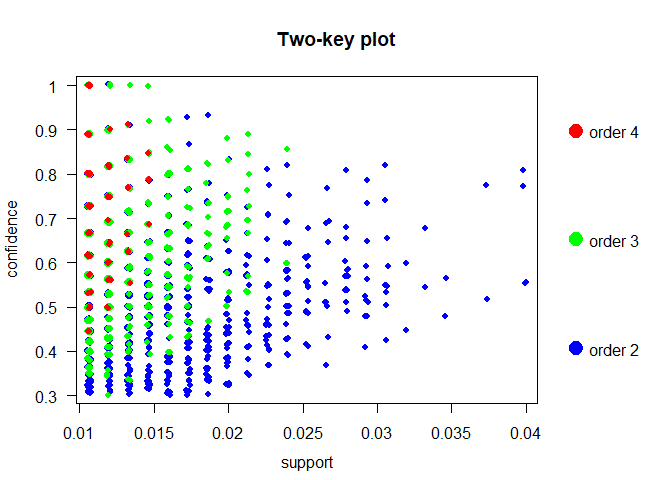
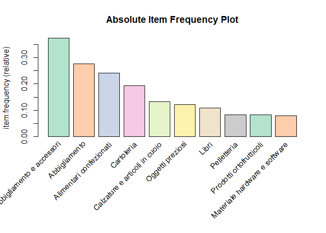
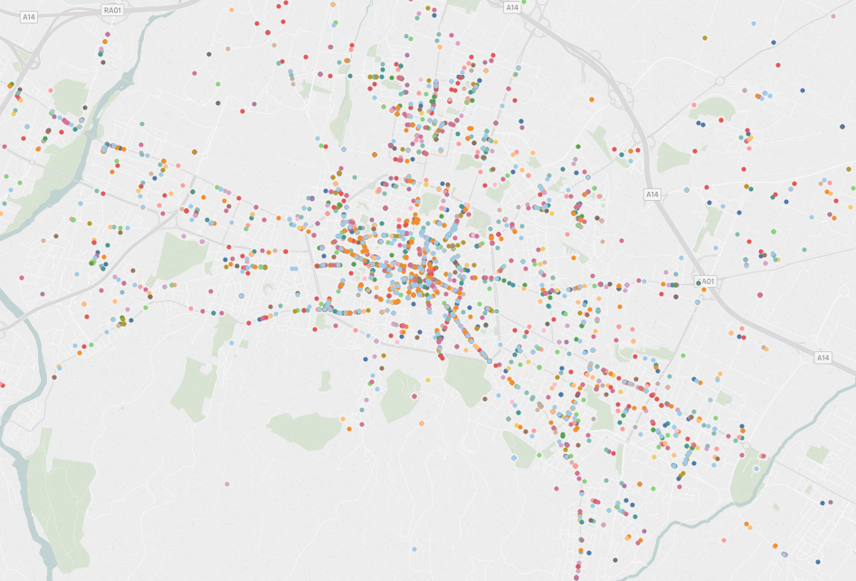

Spatial Association Rules For Geomarketing Purposes
================
Alessandro Festi
04 giugno 2019

<center>
Alessandro Festi
</center>
<br/>

<font size = '2'> Market basket analysis is a widely employed technique in marketing which provides suggestions of products to buy to a customer, given the past purchases made by the customers, basing upon the statistical methodology of association rules. This technique has been initially conceived to analyse transactions of products where the dataset is composed of sets of items purchased in different periods of time by N individuals, for instance formed from a large number of receipts collected in a point of sale of a large-scale retail trade. This chapter extends the application of market basket analysis to the geolocation points of N people in a specific space in order to discover associations among places that individuals have visited. When dealing with products, the goal is to link products while here it is linking locations. Similarly, one needs the sets of geolocation points for each individual considered in many different occasions. <br/> This code follows my article published by Springer </font>

``` r
library(geosphere)
library(rgeos)
library(shiny)
library(leaflet)
library(plyr) 
library(dplyr)
library(jsonlite)
library(arules)
library(MASS)
library(sp)
library(taRifx)
library(arulesViz)
library(readr)
library(tidyr)
library(raster)
library(ggplot2)
library(RColorBrewer)
library(readr)
library(readxl)
```

An overview of the iperbole dataset, downloadable here: <http://dati.comune.bologna.it/node/640>

<center>
</center>
 <br/>

The R package 'reticulate' helps us integrating the Python language in the R environment. In the Iperbole dataset there are not latitude and longitude coordinates for the commercial activities in Bologna. We can get them using the geographic information we already have and geocoding it through the Mapbox API's using Python. Then the general analysis is implemented using R. <br/>

``` r
library(reticulate)
```

    ## Warning: package 'reticulate' was built under R version 3.4.4

``` r
use_python('C:\\Users\\afesti\\AppData\\Roaming\\Microsoft\\Windows\\Start Menu\\Programs\\Python 3.6')
```

``` python
import pandas as pd
import numpy as np 
from mapbox import Geocoder
import json

dataset = pd.read_csv("C:\\Users\\Alessandro\\elenco_esercizicommerciosedefissa_anno_2017.csv", sep = ';', header='infer', encoding='latin-1')

dataset['quartiere_settore'] = dataset.ESERCIZIO_VIA+'  '+dataset.ESERCIZIO_CIVICO+' '+dataset.QUARTIERE+' Bologna'

dataset['lat'] = float
dataset['lon'] = float

token = token
geocoder = Geocoder(access_token=token)

for i in range(len(dataset)):
    try:
        response = geocoder.forward(dataset.quartiere_settore[i])
        ale = response.content
        d = json.loads(ale)
        coordinates = d["features"][0]['geometry']['coordinates']
        dataset.iat[i,29] = coordinates[1]
        dataset.iat[i,30] = coordinates[0]
    except:
        dataset.iat[i,29] = np.nan
        dataset.iat[i,30] = np.nan

dataset.to_excel('geocoded.xlsx')
```

``` r
geocoded <- read_excel("C:\\Users\\Alessandro\\Desktop\\geocoded.xlsx")
geocoded <- dplyr::distinct(geocoded, lat, lon, .keep_all = TRUE)
```

<br/> Having obtained thir lat/lon coordinates, the position of the commercial activities in Bologna are plotted using Tableau <br/>
<center>
</center>
<center>

</center>
<br/>

Then the individual paths are simulated. In this case the number of simulated individuals is set to 50, each of them on 15 different occasions, geocoded 20 different times for each occasion. <br/>

``` r
n_individuals <- 50
n_paths <- 15
n_positions <- 20

points <- data.matrix(cbind(rnorm(n_individuals)/250 + 11.342220, rnorm(n_individuals)/250 + 44.493674)) 
correlation <- 0.7

paths_gen <- function(points) {
  paths_one <- c()
    for (j in 1:nrow(points)) {  
       for (i in 1:n_paths) {           
         mu <- rep(0,n_positions) 
         Sigma <- matrix(correlation, nrow=n_positions, ncol=n_positions) + diag(n_positions)*.3
         rawvars <- mvrnorm(n=n_positions, mu=mu, Sigma=Sigma) 
         geo_points <- as.data.frame(cbind(rawvars[,i]/250 + as.double(points[j]), rawvars[,i]/250 + as.double(points[j+nrow(points)])))
         gg <- cbind(geo_points, i, j)
         paths_one <- rbind(paths_one, gg)
       }
    }  
  return(as.data.frame(paths_one))
}

path_vis <- as.data.frame(paths_gen(points))
path_vis <- plyr::rename(path_vis, c("V1"="lon", "V2"="lat", "i"="path", "j"="ind"))
head(path_vis,10)
```

    ##         lon      lat path ind
    ## 1  11.35349 44.49532    1   1
    ## 2  11.34565 44.48749    1   1
    ## 3  11.34353 44.48536    1   1
    ## 4  11.34690 44.48873    1   1
    ## 5  11.34272 44.48455    1   1
    ## 6  11.35194 44.49377    1   1
    ## 7  11.34790 44.48973    1   1
    ## 8  11.34061 44.48245    1   1
    ## 9  11.34571 44.48754    1   1
    ## 10 11.34886 44.49069    1   1

<br/> Then, in order to infer if a person was at a certain activity, the individual positions are matched with the positions of the geocoded commercial activities in Bologna on the basis of an arbitrary minimum distance(Euclidean distance).

``` r
path_v <- data.matrix(cbind(path_vis$lon,path_vis$lat))
places <- cbind(geocoded$lon, geocoded$lat)
places[is.na(places)] <- 0
min_dist <- 0.0005

assign <- function(geo_points) {
  geo_pointsTOplaces <- list()
    for(j in 1:nrow(path_v)) {
        x <- spDistsN1(places,path_v[j,], longlat = FALSE)
        x <- as.data.frame(x)
        qq <- which(x == min(x), arr.ind = TRUE)
        qq <- as.data.frame(qq) 
        nearest <- sort(x[x>0],decreasing=F)[1]
        geo_pointsTOplaces$distance[j] <- nearest
        if (nearest < min_dist) { 
          geo_pointsTOplaces$lon[j] <- places[qq[1,1],1]
          geo_pointsTOplaces$lat[j] <- places[qq[1,1],2]
        } else {
          geo_pointsTOplaces$lon[j] <- NA
          geo_pointsTOplaces$lat[j] <- NA 
        }
      }
  return(geo_pointsTOplaces)
}

result <- as.data.frame(assign(geo_points))
result <- as.data.frame(cbind(result$lon, result$lat, result$distance, path_vis$path, path_vis$ind))
result <- plyr::rename(result, c("V1"="lon", "V2"="lat", "V3"="dist", "V4"="path", "V5"="ind"))
head(result)
```

    ##        lon      lat         dist path ind
    ## 1 11.35381 44.49555 3.918118e-04    1   1
    ## 2       NA       NA 5.935997e-04    1   1
    ## 3       NA       NA 2.241884e-03    1   1
    ## 4       NA       NA 6.356600e-04    1   1
    ## 5       NA       NA 3.329103e-03    1   1
    ## 6 11.35191 44.49382 5.586108e-05    1   1

<font size = '2'> Adjusting the dataset for the association rules discovery eliminating the non-matched observations </font>

``` r
result <- na.omit(result)
head(result)
```

    ##         lon      lat         dist path ind
    ## 1  11.35381 44.49555 3.918118e-04    1   1
    ## 6  11.35191 44.49382 5.586108e-05    1   1
    ## 11 11.34732 44.48925 3.375501e-04    1   1
    ## 14 11.35097 44.49251 4.641712e-04    1   1
    ## 15 11.35097 44.49251 4.544435e-04    1   1
    ## 21 11.34480 44.48720 4.013597e-04    2   1

Merging process to retrieve the index of the matched company

``` r
index <- dplyr::select(geocoded,lat,lon, IND)
index <- plyr::rename(index, c("lat" = "lat", "lon" = "lon", "IND" = "ID"))
final <- merge(x=index, y=result, by.x = c("lon","lat"), by.y = c("lon","lat"))
final$itemset_id <- paste(final$ind,final$path)
head(final,10)
```

    ##         lon      lat   ID         dist path ind itemset_id
    ## 1  11.32825 44.49041 6872 0.0004577361    4  31       31 4
    ## 2  11.32834 44.48821 3561 0.0004020383    6  28       28 6
    ## 3  11.32834 44.48821 3561 0.0003613516    5  28       28 5
    ## 4  11.32834 44.48821 3561 0.0003853404    4  28       28 4
    ## 5  11.32834 44.48821 3561 0.0003648597   15  28      28 15
    ## 6  11.32834 44.48821 3561 0.0001833690    2   3        3 2
    ## 7  11.32834 44.48821 3561 0.0004016086    5  28       28 5
    ## 8  11.32834 44.48821 3561 0.0003653974    3  28       28 3
    ## 9  11.32834 44.48821 3561 0.0004414480    8  28       28 8
    ## 10 11.32834 44.48821 3561 0.0004571947    4  28       28 4

Then one needs to transform the data into a transaction dataset

``` r
# Preparing for Association rules
transactionData <- ddply(final,c("itemset_id"),
                         function(final)paste(final$ID,
                                              collapse = ","))
```

The dataset is read again into R as a transaction object. The most frequent visited companies are displayed in the absolute frequency plot below

``` r
write.csv(transactionData,"C:\\Users\\Alessandro\\Desktop\\transaction_data.csv", quote = FALSE, row.names = TRUE)
tr <- read.transactions('C:\\Users\\Alessandro\\Desktop\\transaction_data.csv', format = 'basket', sep=',')
```

    ## Warning in asMethod(object): removing duplicated items in transactions

``` r
itemFrequencyPlot(tr,topN=20,type="relative",col=brewer.pal(8,'Pastel2'), main="Absolute Item Frequency Plot")
```

 <br/> Performing the Market Basket Analysis through the apriori algorithm

``` r
association.rules <- arules::apriori(tr, parameter = list(supp=0.01, conf=0.3,maxlen=10))
```

    ## Apriori
    ## 
    ## Parameter specification:
    ##  confidence minval smax arem  aval originalSupport maxtime support minlen
    ##         0.3    0.1    1 none FALSE            TRUE       5    0.01      1
    ##  maxlen target   ext
    ##      10  rules FALSE
    ## 
    ## Algorithmic control:
    ##  filter tree heap memopt load sort verbose
    ##     0.1 TRUE TRUE  FALSE TRUE    2    TRUE
    ## 
    ## Absolute minimum support count: 7 
    ## 
    ## set item appearances ...[0 item(s)] done [0.00s].
    ## set transactions ...[2057 item(s), 750 transaction(s)] done [0.00s].
    ## sorting and recoding items ... [279 item(s)] done [0.00s].
    ## creating transaction tree ... done [0.00s].
    ## checking subsets of size 1 2 3 4 5 done [0.00s].
    ## writing ... [2047 rule(s)] done [0.00s].
    ## creating S4 object  ... done [0.00s].

``` r
inspect(association.rules[1:10])
```

    ##      lhs       rhs    support    confidence lift     count
    ## [1]  {1409} => {1649} 0.01066667 0.8888889  51.28205  8   
    ## [2]  {1649} => {1409} 0.01066667 0.6153846  51.28205  8   
    ## [3]  {6738} => {1776} 0.01066667 0.8000000  54.54545  8   
    ## [4]  {1776} => {6738} 0.01066667 0.7272727  54.54545  8   
    ## [5]  {6738} => {1649} 0.01200000 0.9000000  51.92308  9   
    ## [6]  {1649} => {6738} 0.01200000 0.6923077  51.92308  9   
    ## [7]  {1776} => {1649} 0.01333333 0.9090909  52.44755 10   
    ## [8]  {1649} => {1776} 0.01333333 0.7692308  52.44755 10   
    ## [9]  {1184} => {1533} 0.01066667 1.0000000  25.86207  8   
    ## [10] {5462} => {3209} 0.01066667 1.0000000  41.66667  8

``` r
plot(association.rules, method = "two-key plot")
```

    ## To reduce overplotting, jitter is added! Use jitter = 0 to prevent jitter.



``` r
plot(association.rules, method = "graph")
```

    ## Warning: plot: Too many rules supplied. Only plotting the best 100 rules
    ## using 'support' (change control parameter max if needed)


``` r
plot(association.rules[1:20], method = "graph")
```

 <br/> The same approach is applied, rather than on company indexes, on their commercial sector

``` r
index_cat <- dplyr::select(geocoded,lat,lon, ATTIVITA_PREVALENTE_ESERCIZIO)
index_cat <- plyr::rename(index_cat, c("lat" = "lat", "lon" = "lon", "ATTIVITA_PREVALENTE_ESERCIZIO" = "Commercial type"))
final_cat <- merge(x=index_cat, y=result, by.x = c("lon","lat"), by.y = c("lon","lat"))
final_cat$itemset_id <- paste(final_cat$ind,final_cat$path)
final_cat <- na.omit(final_cat)
head(final_cat)
```

    ##         lon      lat                     Commercial type         dist path
    ## 15 11.32918 44.49045 Tabacco e altri generi di monopolio 0.0003147564    6
    ## 16 11.32918 44.49045 Tabacco e altri generi di monopolio 0.0003730165    9
    ## 17 11.32918 44.49045 Tabacco e altri generi di monopolio 0.0004194769   14
    ## 18 11.32918 44.49045 Tabacco e altri generi di monopolio 0.0001991561    6
    ## 19 11.32978 44.49097 Articoli per l'igiene della persona 0.0001661084    5
    ## 20 11.32978 44.49097 Articoli per l'igiene della persona 0.0003595585    3
    ##    ind itemset_id
    ## 15  31       31 6
    ## 16  31       31 9
    ## 17  31      31 14
    ## 18  29       29 6
    ## 19  29       29 5
    ## 20  31       31 3

``` r
transactionData_cat <- ddply(final_cat,c("itemset_id"),
                         function(final_cat)paste(final_cat$`Commercial type`,
                                              collapse = ","))
```

``` r
write.csv(transactionData_cat,"C:\\Users\\Alessandro\\Desktop\\transaction_data_cat.csv", quote = FALSE, row.names = TRUE)
tr_cat <- read.transactions('C:\\Users\\Alessandro\\Desktop\\transaction_data_cat.csv', format = 'basket', sep=',')
itemFrequencyPlot(tr_cat,topN=10,type="relative",col=brewer.pal(8,'Pastel2'), main="Absolute Item Frequency Plot")
```

 <br/> The positions of the commercial activities in Bologna are then plotted using Tableau according to their sector.

<center>
</center>


<br/> Performing the Market Basket Analysis through the apriori algorithm on the sector

``` r
association.rules_cat <- arules::apriori(tr_cat, parameter = list(supp=0.03, conf=0.5,maxlen=5))
```

    ## Apriori
    ## 
    ## Parameter specification:
    ##  confidence minval smax arem  aval originalSupport maxtime support minlen
    ##         0.5    0.1    1 none FALSE            TRUE       5    0.03      1
    ##  maxlen target   ext
    ##       5  rules FALSE
    ## 
    ## Algorithmic control:
    ##  filter tree heap memopt load sort verbose
    ##     0.1 TRUE TRUE  FALSE TRUE    2    TRUE
    ## 
    ## Absolute minimum support count: 22 
    ## 
    ## set item appearances ...[0 item(s)] done [0.00s].
    ## set transactions ...[1656 item(s), 737 transaction(s)] done [0.00s].
    ## sorting and recoding items ... [29 item(s)] done [0.00s].
    ## creating transaction tree ... done [0.00s].
    ## checking subsets of size 1 2 3 done [0.00s].
    ## writing ... [12 rule(s)] done [0.00s].
    ## creating S4 object  ... done [0.00s].

``` r
inspect(association.rules_cat[1:5])
```

    ##     lhs                            rhs                            support confidence     lift count
    ## [1] {Profumeria}                => {Abbigliamento e accessori} 0.04070556  0.7500000 1.738208    30
    ## [2] {Strumenti musicali dischi} => {Abbigliamento e accessori} 0.03527815  0.5909091 1.369497    26
    ## [3] {Mobili}                    => {Oggetti preziosi}          0.04206242  0.5438596 3.485431    31
    ## [4] {Mobili}                    => {Abbigliamento e accessori} 0.04206242  0.5438596 1.260455    31
    ## [5] {Libri}                     => {Abbigliamento e accessori} 0.04477612  0.5000000 1.158805    33

``` r
plot(association.rules_cat, method = "graph")
```

 \`\`\`
